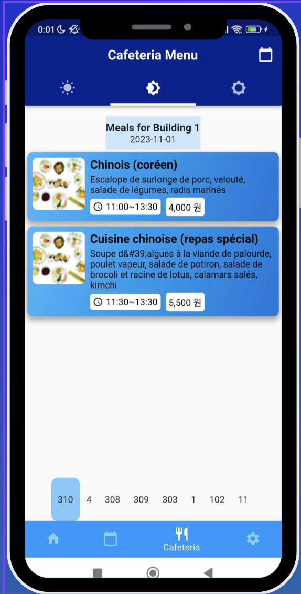

<div align="center">
    <h1>Chung Ang University App</h1>
</div>

## 📓 Description 📓

The Chung Ang University App is designed to streamline various aspects of university life for students and faculty.

## 📦 Installation 📦

To install the app, follow these steps:

1. Clone the repository:

    ```
    git clone https://github.com/BastienBoymond/chung-ang_univ_application.git
    ```

2. Navigate to the project directory:

    ```
    cd chung-ang-university-app
    ```

3. Install dependencies:

    ```
    flutter pub get
    ```

4. Launch the app:

    ```
    flutter start
    ```

## 📝 Features 📝

- **Class Schedule:** Easily view and manage your class schedule.
- **Event Notifications:** Receive notifications about important university events.
- **Food schedule:** View the food schedule for the university cafeteria.
- **Theme:** Choose between light and dark mode.

## 📷 Screenshots 📷



## 🏷️ Team 🏷️

This project was developed by:

* <strong><a href="https://github.com/BastienBoymond">Bastien Boymond</a></strong>
* <strong><a href="https://github.com/Lyne986">Diogo Faria Martins</a></strong>
* <strong><a href="https://github.com/Carpetic">Hugo Nini</a></strong>
* <strong><a href="https://github.com/ThomyLorenzatti">Thomas Lorenzatti</a></strong>

Feel free to contribute by forking the repository and submitting pull requests.

